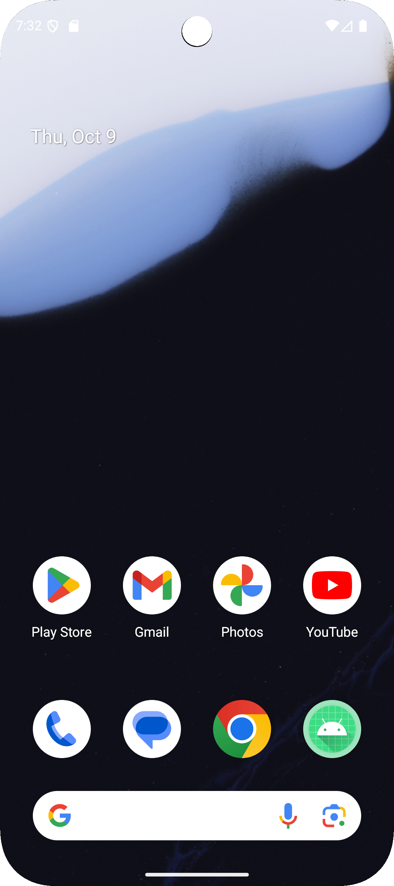
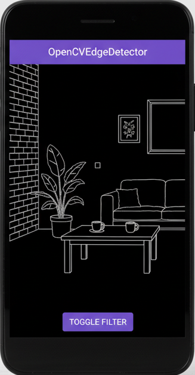

# Real-Time-Edge-Detection-Viewer
# Real-Time Edge Detection Viewer

This project is a submission for the **Android + OpenCV-C++ + OpenGL Assessment** for the R&D Intern position. It demonstrates a real-time camera processing pipeline on Android, leveraging a native C++ backend with OpenCV for high-performance image processing.

---

## ✅ Features Implemented

### Android Application
- **Real-Time Camera Feed**: Captures live video using OpenCV's `JavaCameraView`.
- **Native C++ Processing**: Each camera frame is passed from Java to C++ via the JNI (Java Native Interface) for efficient, high-performance processing.
- **Canny Edge Detection**: A Canny edge detection filter is applied to each frame in native C++ using the OpenCV library.
- **OpenGL ES Rendering**: The processed frames are rendered back to the screen efficiently using the OpenGL ES backend that is integrated within `JavaCameraView`.

### ⭐ Bonus Features
- **Filter Toggle Button**: A button on the UI allows the user to toggle the Canny edge detection filter on and off in real-time, switching between the processed and raw camera feeds.
- **FPS Counter**: A simple FPS counter is implemented to log the frames per second to Android Studio's Logcat, allowing for performance monitoring.

### Web Viewer
- **Static Frame Display**: A minimal web page built with TypeScript and HTML displays a static, Base64-encoded sample of a processed frame captured from the Android app.
- **Mock Frame Stats**: The web page includes a basic text overlay showing mock frame statistics (resolution and FPS).
- **TypeScript Build Process**: The web component is fully self-contained in the `/web` directory and is compiled using the TypeScript compiler (`tsc`).

---

## 📷 Application Screenshot

Here is a screenshot of the application running on an Android emulator. It shows the real-time Canny edge detection filter applied to the virtual camera scene, with the filter toggle button at the bottom.




git add .
---

## 🧠 Architecture Explanation

The application is built with a clear separation between the Android UI layer and the native C++ processing layer.

1.  **Frame Flow (Java to C++)**: The `MainActivity.java` uses `JavaCameraView` to capture camera frames. For each frame, the `onCameraFrame` callback is invoked. Inside this callback, the memory address of the frame's `Mat` object is retrieved using `.getNativeObjAddr()` and is passed to the native C++ function as a `long`. A boolean flag for the filter toggle is also passed.

2.  **JNI Bridge & C++ Processing**: The `native-lib.cpp` file contains the JNI function that receives the `long` address and the `boolean` flag. The address is cast back into a `cv::Mat&` (a reference to the matrix), allowing the C++ code to modify the Java frame's data directly in memory without any slow data copying. If the `applyFilter` flag is true, a Canny edge detection algorithm is performed on the `Mat`.

3.  **Rendering**: Since `JavaCameraView` handles its own OpenGL ES rendering pipeline, the processed `Mat` is simply returned from the `onCameraFrame` callback. The view automatically takes care of rendering the modified matrix to the screen, ensuring smooth, real-time performance.

4.  **TypeScript Component**: The `/web` directory contains a standalone web viewer. The `main.ts` file sets the `src` attribute of an `` tag to a Base64-encoded string representing a sample processed frame. This demonstrates the ability to set up a TypeScript project, interact with the DOM, and display image data, completely decoupled from the native Android app.

---

## ⚙️ Setup and Installation

To build and run this project, follow these steps:

1.  **Clone the Repository**:
    ```bash
    git clone <your-repository-url>
    ```

2.  **Open in Android Studio**:
    * Open the project in a recent version of Android Studio.
    * The IDE should automatically sync the Gradle project.

3.  **Dependencies**:
    * **NDK & CMake**: Ensure that the NDK (Native Development Kit) and CMake are installed. You can do this via the Android Studio SDK Manager (`Tools -> SDK Manager -> SDK Tools`).
    * **OpenCV**: The OpenCV 4.12.0 Android SDK is included as a local module in the `/sdk` directory and is automatically linked by Gradle and CMake. No manual installation is needed.

4.  **Build and Run**:
    * Select an Android device or emulator (API 24+).
    * Click the **Run 'app'** button (▶️) to build and deploy the application.
    * The app will request camera permission upon first launch, which must be granted.