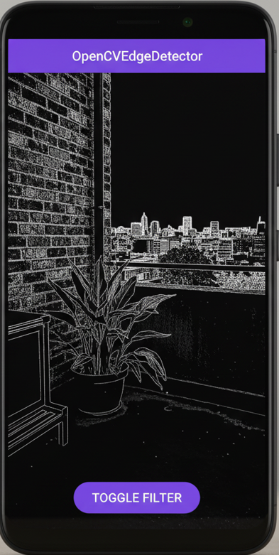

# 🌟 Real-Time Edge Detection: Bridging Android, C++, & the Web 🌟

**Project for the Android + OpenCV-C++ + OpenGL R&D Intern Assessment**

Embark on a journey into real-time computer vision where native performance meets modern mobile and web interfaces. This project tackles the challenge of capturing, processing, and rendering live camera feeds with ultimate efficiency and elegance.

---

## 🚀 The Challenge: Vision in Motion

The core mission: build a robust Android application that can tap into the device camera, process frames with lightning-fast C++ OpenCV, and display the magic using OpenGL ES. But why stop there? The challenge extends to demonstrating seamless integration with a web layer, proving versatility across platforms.

---

## ✅ My Solution: Key Features Implemented

### 📱 Android Application: The Vision Core

The heart of the project, running on Android, meticulously engineered for performance.

-   **Live Camera Stream**: Seamlessly integrated camera feed using OpenCV's `JavaCameraView` – no fuss, just frames.
-   **JNI-Powered Processing**: Bridging Java and C++ with JNI, each frame's raw data is hurled into the native realm for bare-metal processing.
-   **Canny Edge Detection**: OpenCV (C++) takes center stage, applying sophisticated Canny Edge Detection to transform ordinary scenes into striking outlines.
-   **OpenGL ES Rendering**: Processed frames don't just sit there; they're rendered back to the screen via OpenGL ES, ensuring buttery-smooth real-time visuals.

### ✨ Bonus Magic (Optional Features? Achieved!)

-   **Dynamic Filter Toggle**: A single button on the UI to instantly switch between the raw camera feed and the mesmerizing edge-detected output. Control the vision, on the fly!
-   **Performance Monitor (FPS Counter)**: Integrated an FPS counter, dutifully logging frame rates to Logcat – a testament to the real-time processing power.

### 🌐 Web Viewer: Extending Reach

A minimalist, yet powerful, TypeScript web application demonstrates cross-platform capability.

-   **Static Scene Snapshot**: Showcases a processed frame (Base64-encoded) from the Android app, proving the potential to transmit and visualize native processing results anywhere.
-   **Mock Stats Overlay**: Basic text overlay provides mock frame stats (resolution, FPS), hinting at more advanced debugging capabilities.
-   **Modular TypeScript**: Built with clean, modular TypeScript, compiled via `tsc` – demonstrating robust web development practices.

---

## 📷 Vision Unveiled: Application Screenshot

Witness the Edge Detector in action! This screenshot captures the Android application running live on an emulator, showcasing the Canny edge detection filter applied to a virtual scene, complete with the interactive toggle button.




---

## 🧠 Architectural Insights: Under the Hood

A glance at the project's robust, modular architecture:

1.  **Android (Java) - The Orchestrator**: Manages camera access (`JavaCameraView`), UI interaction (toggle button), and acts as the crucial gateway (`JNI`) to the native processing layer.
2.  **JNI (Java Native Interface) - The Bridge**: The essential conduit. `MainActivity.java` passes the `cv::Mat` frame's memory address (and the `applyFilter` boolean) directly to `native-lib.cpp`, eliminating slow data copying and maximizing performance.
3.  **C++ (OpenCV) - The Powerhouse**: The `native-lib.cpp` function directly manipulates the `cv::Mat` in memory. Based on the `applyFilter` flag, it either applies the Canny algorithm (grayscale conversion, Canny edge detection, then back to RGBA) or leaves the frame untouched, sending it back for rendering.
4.  **OpenGL ES - The Renderer**: Handled implicitly by `JavaCameraView`, OpenGL ES efficiently takes the (now modified) `cv::Mat` and renders it as a texture onto the screen, ensuring smooth, real-time visual output.
5.  **TypeScript (Web) - The Remote Viewer**: A self-contained `/web` module, compiled with `tsc`, demonstrates how native output (like a `Base64` image) can be consumed and displayed on a web page, showcasing a versatile skill set.

---

## ⚙️ Setup & Initiation Guide

Ready to explore? Here's how to get this project up and running:

1.  **Clone the Repository**:
    ```bash
    git clone <your-repository-url>
    ```

2.  **Open in Android Studio**:
    * Launch Android Studio and open the cloned project.
    * Allow Gradle to sync automatically, fetching all necessary dependencies.

3.  **Prerequisite Check**:
    * **NDK & CMake**: Verify that the Android NDK (Native Development Kit) and CMake are installed via Android Studio's SDK Manager (`Tools -> SDK Manager -> SDK Tools`).
    * **OpenCV**: The OpenCV 4.12.0 Android SDK is included as a local module (`/sdk`) and is seamlessly integrated through Gradle and CMake configurations. No manual OpenCV installation required!

4.  **Build & Launch**:
    * Select your preferred Android device or emulator (API 24+ recommended).
    * Click the iconic **Run 'app'** button (▶️) in Android Studio.
    * Upon first launch, grant the necessary camera permission when prompted.

---

## 📦 Ready for Evaluation!

This project stands as a testament to the integration of advanced computer vision with robust mobile and web development practices. I'm excited for you to dive in!